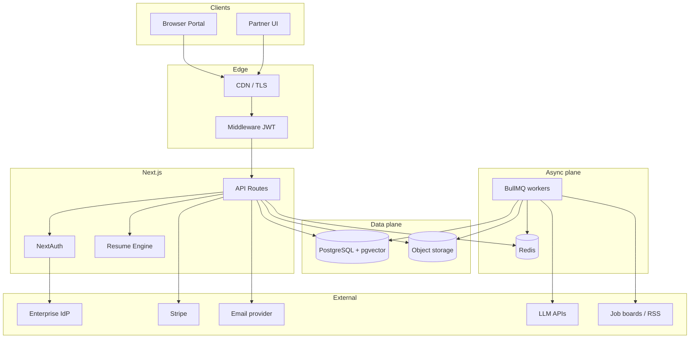
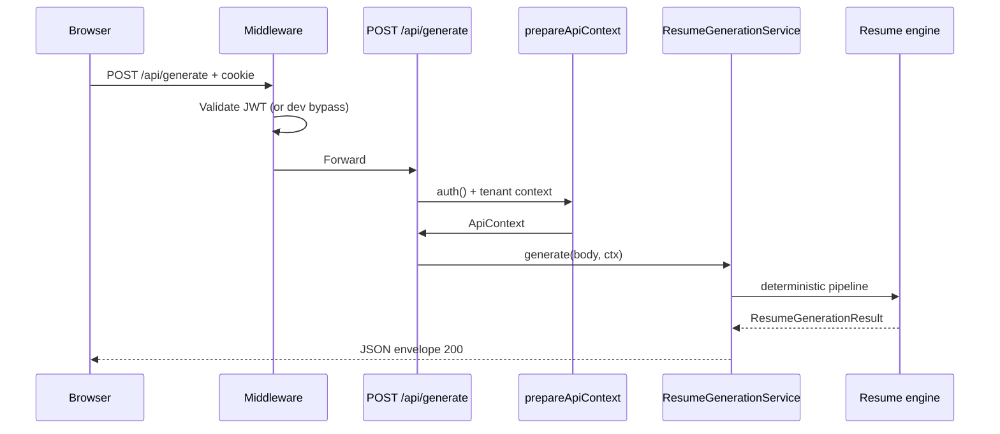

# Production master plan — askmehire

**Purpose:** Single companion for **gap analysis**, **roadmap**, **hardening**, **executive framing**, and **engineering planning** relative to the major production gaps called out for this codebase. It does not replace [BRD.md](./BRD.md), [FSD.md](./FSD.md), [TDD.md](./TDD.md), or [STATUS.md](./STATUS.md); it ties them to delivery sequencing and risk.

**Audience:** CTO, staff engineers, PM, investors (skim §1–2 and §19), security/compliance reviewers (§14).

---

## 1. Executive summary (investor / CTO)

askmehire has a **strong deterministic resume intelligence core** and a **credible multi-tenant portal UX**, with **PostgreSQL + Prisma** for core entities and **NextAuth JWT credentials + server RBAC** for API access. That is enough for **controlled pilots** and **design partners** if operations, secrets, and backups are disciplined.

**What is not yet enterprise-grade:** live job and email connectors, **Stripe-grade billing**, **vector retrieval at scale**, **durable async work** beyond optional BullMQ wiring, **SOC2-style evidence** (access reviews, change management, pen test artifacts), and **full migration of portal state** off `localStorage`. **Rate limiting** is in-process; **observability** is partially instrumented.

**Investment thesis (technical):** The product differentiator is **governed content + explainable generation + application safety**. The capital-efficient path is to (1) finish **one real connector** and **billing meter** to prove revenue, (2) add **Redis-backed limits + traces** for reliability, (3) land **embeddings + search** for defensibility, then (4) broaden persistence and compliance.

---

## 2. Gap analysis (major pending production items)

| Gap | Current baseline | Target production state | Risk if deferred | Typical dependency |
|-----|-------------------|-------------------------|------------------|-------------------|
| **Real connector integrations** | Seeded `syncJobsForCandidate` + `JOB_LISTINGS` in DB; UI demo rotation | OAuth/API/RSS/human-assisted capture per portal ToS; watermarks; dedupe keys | Stale jobs; ToS violations; no moat | Legal review, secrets vault, worker capacity |
| **Embeddings / vector search** | Schema supports `vector(1536)`; no generation pipeline | Embed JDs, components, resume bullets; IVFFlat/HNSW; hybrid lexical + vector | Poor match quality at scale | Model choice, batch jobs, index tuning |
| **Queue / workers** | BullMQ scaffold; generation synchronous | Queued long runs, connector sync, embedding refresh, webhooks | Timeouts; uneven load | Redis, worker deploy topology |
| **Billing integration** | UI + seeded ledger | Stripe (or Paddle) products, metered usage, tax, dunning, invoices | No revenue; manual ops | Product SKUs, webhook idempotency |
| **Email infrastructure** | UI states only | SES/SendGrid + inbound parsing + approval workflow persistence | No closed loop on outreach | Domains, DMARC, suppression lists |
| **Full persistence migration** | Many flows still `localStorage` | Profiles, runs, mail, templates in Postgres with audit | Data loss; no multi-device | Schema design, migrations, backfill |
| **Observability + Redis rate limits** | Pino + OTEL hooks partial; in-memory limiter | Redis limiter; dashboards; SLOs on generate/connectors | Noisy neighbors; blind incidents | Redis, Grafana/Datadog, budgets |
| **SSO / enterprise auth** | NextAuth credentials + JWT | SAML/OIDC (Workforce), SCIM provisioning, session policies | Blocked enterprise deals | IdP contracts, security review |
| **CI / E2E coverage** | Vitest unit (RBAC, catalog match) | GitHub Actions: typecheck, test, build; Playwright smoke + API contract tests | Regressions ship | CI minutes, test DB |

---

## 3. Architecture review (current vs target)

### 3.1 Current (simplified)

- **Edge:** Next.js middleware (JWT for `/api/*`, security headers).
- **App:** App Router, `ProductionPortalApp`, NextAuth session.
- **API:** Zod validation, envelope JSON, `prepareApiContext` → services → repositories → Prisma.
- **Data:** Postgres (tenants, users, jobs, applications, components, resumes, audit events).
- **Async:** Optional BullMQ + Redis (not required for happy-path demo).

### 3.2 Target decomposition (logical services)

These map cleanly to future bounded contexts (separate deployables or worker pools):

| Context | Responsibility |
|---------|----------------|
| Identity & tenant | SSO, SCIM, tenant lifecycle, impersonation audit |
| Resume intelligence | Deterministic engine + optional LLM orchestration |
| Component governance | CRUD, embeddings, similarity, publish workflow |
| Job ingestion | Connectors, normalization, dedupe, compliance |
| Application tracking | State machine, artifacts, SLA metrics |
| Communications | Email send/receive, approvals, retention |
| Billing & metering | Stripe, usage events, entitlements |
| Platform ops | Rate limits, quotas, feature flags, support tooling |

### 3.3 System decomposition (diagram)

---

## 4. Sequence diagram — authenticated generation (today)

**Future variant:** browser → API enqueues job → worker runs engine → client polls or subscribes (SSE/WebSocket) for completion.

---

## 5. Implementation roadmap (phased)

| Phase | Theme | Outcomes | Rough horizon* |
|-------|--------|----------|------------------|
| **P0 — Reliability** | Redis rate limit + structured logs + traces on `/api/generate`, connectors path | Fewer 429 blind spots; incident triage | 1–2 sprints |
| **P1 — Revenue** | Stripe subscription + metered usage events from generation/export | Billable pilot | 2–4 sprints |
| **P2 — Connector v1** | One board (RSS or official API) + stored jobs + legal ToS checklist | Real pipeline proof | 3–5 sprints |
| **P3 — Persistence breadth** | Move profiles, mail drafts, runs off `localStorage` | Audit trail; multi-device | 4–8 sprints |
| **P4 — Intelligence scale** | Embedding jobs + IVFFlat/HNSW + hybrid search | Better retrieval; moat | 4–8 sprints |
| **P5 — Enterprise** | SAML/OIDC, SCIM-lite, SSO-only tenants, security pack | Enterprise sales | 6–12 sprints |

\*Assumes a small senior team; adjust for headcount.

---

## 6. Connector strategy

| Approach | Best for | Pros | Cons |
|----------|----------|------|------|
| **Official API / OAuth** | Dice, LinkedIn (where permitted) | Stable, auditable | Quotas, approval cycles |
| **RSS / public listings** | Boards with open feeds | Fast MVP | Thin data; parsing drift |
| **Human-assisted capture** | Restrictive ToS | Compliance-friendly | Labor cost; throughput cap |
| **Vendor aggregator** | Normalized multi-board | Speed to market | Margin; dependency |

**Recommendation:** Ship **one RSS or API-backed** connector with explicit **human confirm** before any outbound application action; store **source URL**, **fetchedAt**, and **hash** for dedupe; never auto-submit applications without tenant policy + user consent flags.

---

## 7. Vector search design (embeddings pipeline)

1. **Chunking:** JD paragraphs, component `base_logic` + variations, resume bullets (deterministic boundaries first).
2. **Model:** Start with one vendor embedding (e.g. 1536-dim) aligned with `pgvector` column; version embeddings in DB (`embedding_model`, `embedded_at`).
3. **Write path:** Async job after publish/ingest; backfill batch with cursor.
4. **Index:** `CREATE INDEX … USING ivfflat` (or HNSW when available) after N ≥ 10k vectors per tenant or global catalog; `ANALYZE` regularly.
5. **Query:** Hybrid — Postgres `tsvector` / trigram for lexical + vector for semantic; merge with RRF-style scoring in application code initially, SQL later.
6. **Safety:** Do not embed raw PII beyond what policy allows; consider redaction for EU tenants.

---

## 8. Queue and workers

- **Queues:** `generation`, `embedding-refresh`, `connector-sync`, `webhook-delivery`, `email-outbound`.
- **Idempotency:** Job keys from `(tenantId, entityType, entityId, operation)`; store idempotency keys in Postgres.
- **Failure:** DLQ + exponential backoff; poison message alerts.
- **Deploy:** Workers as separate Node processes or container service; scale horizontally; share Redis.

---

## 9. Billing integration

- **Products:** Tenant subscription (seat or flat) + metered SKU (generations, exports, connector sync minutes).
- **Events:** Emit usage from `ResumeGenerationService` and DOCX export with `tenantId`, `userId`, `idempotencyKey`.
- **Webhooks:** Stripe signing secret; store raw events for replay; map to `billing` tables when added to schema.

---

## 10. Email infrastructure

- **Outbound:** SES or SendGrid; per-tenant sending domain or subdomain; bounce/complaint webhooks → suppression table.
- **Inbound:** Inbound parse or Gmail API (workspace); thread id correlation.
- **Approvals:** Persist draft + state machine (`draft` → `approval_requested` → `approved` → `sent`); attach audit events.

---

## 11. Full persistence migration (from localStorage)

Priority order (suggested):

1. **Candidate application profiles** (searchable; tied to `user_id`).
2. **Resume runs / templates** (versioning; links to artifacts).
3. **Mail threads** (compliance retention).
4. **Billing ledger lines** (mirror Stripe + local adjustments).
5. **Admin ops queues** that today are purely client-side mirrors.

Each migration: Prisma model + API + UI read-through with dual-write window if needed.

---

## 12. Observability and Redis-backed rate limiting

- **Tracing:** OpenTelemetry on API routes and workers; propagate `requestId`, `tenantId`, `userId`.
- **Metrics:** p95 latency, error rate, queue depth, connector fetch success, LLM token/cost if enabled.
- **Logging:** JSON logs; no secrets; correlation IDs.
- **Rate limiting:** `rate-limiter-flexible` with **Redis** store; keys `(routeKey, tenantId, userId, ip)` per product policy; separate **burst** vs **sustained** limits for expensive routes.

---

## 13. SSO and enterprise auth hardening

- **Short term:** Enforce `AUTH_SECRET` rotation playbook; shorten JWT TTL for high-risk tenants; optional IP allowlist per tenant (feature flag).
- **Medium term:** SAML/OIDC via NextAuth providers or dedicated IdP (Auth0/Clerk/WorkOS) with **tenant ↔ IdP** mapping.
- **Long term:** SCIM provisioning, group → role mapping, session revocation on offboarding webhooks.

---

## 14. Security and SOC2-oriented posture (lightweight assessment)

This is **not** a certification; it is a **gap list** toward SOC2-style evidence common in B2B SaaS.

| Control area | Current | Target evidence |
|----------------|---------|------------------|
| Access | RBAC + JWT | SSO, quarterly access reviews, break-glass procedure |
| Change management | Git + PRs | Required review, protected `main`, deployment approvals |
| Logging & monitoring | Partial | Centralized logs, retention policy, alerts on auth failures |
| Data protection | TLS, Postgres | Encryption at rest, key rotation, backup/restore tests |
| Vendor risk | Minimal | Subprocessor list, DPAs, annual review |
| Incident response | Ad hoc | Runbook, on-call, customer notification template |

**Security audit (internal):** annual dependency scan, SAST, container scan, pen test before large enterprise deals.

---

## 15. Deployment strategy

| Layer | Pragmatic default | Notes |
|-------|-------------------|--------|
| Frontend / API | Vercel or similar managed Node | Edge middleware compatible |
| Database | RDS Postgres + pgvector | Multi-AZ; automated backups; PITR |
| Redis | ElastiCache / Upstash | For rate limit + BullMQ |
| Object storage | S3 or R2 | Private buckets; signed URLs for downloads |
| Workers | ECS/Fargate, Fly.io, or K8s job | Same image as API with different CMD |
| Secrets | AWS Secrets Manager / Doppler | No secrets in env files in prod |

**Blue/green or canary:** API first; workers tolerate old/new message shape during rollout (version field in payloads).

---

## 16. Infra cost modeling (order-of-magnitude, US East, 2026)

Figures are **indicative** for a pilot through small SaaS; actuals depend on traffic and data volume.

| Component | Small pilot (~100 active users) | Growth (~2k users, steady API) |
|-----------|-----------------------------------|----------------------------------|
| Postgres (managed) | ~$50–150/mo | ~$300–800+/mo |
| Redis | ~$15–40/mo | ~$80–250/mo |
| Object storage | ~$5–20/mo | ~$50–200/mo |
| App compute (API + workers) | Included in Vercel tier or ~$50–200/mo | ~$300–1500/mo |
| Observability | Free tier or ~$30/mo | ~$200–600/mo |
| LLM (if enabled) | Usage-based dominant | Often **largest** variable cost |

Add **10–20%** contingency for egress and support tooling.

---

## 17. Event-driven architecture (optional redesign)

**Today:** synchronous API + optional queue scaffold.

**Target pattern:** **Outbox** table in Postgres (`outbox_events`) written in same transaction as domain mutation; relay publishes to Redis streams or SQS; workers consume. Benefits: reliable side effects (email, Stripe, embeddings), replay, and clearer scaling story.

**When to adopt:** When webhook volume or generation latency forces decoupling; not required for first paid pilots if p95 stays within SLO.

---

## 18. Multi-tenant SaaS recommendations

- **Tenant isolation:** Continue `tenant_id` on all tenant-scoped rows; consider **Postgres RLS** policies keyed from session context for defense in depth.
- **Cross-tenant queries:** Forbidden in application code; super-admin uses explicit impersonation with audit (already sketched in API layer).
- **Data residency:** EU tenants → EU region deploy or database pinning; document subprocessor locations.
- **Noisy neighbor:** Per-tenant rate limits and fair queueing; largest tenants get dedicated worker pools if needed.

---

## 19. Resume engine and AI pipeline optimization

| Theme | Action |
|-------|--------|
| **Deterministic core** | Golden-file tests per strategy; regression on catalog changes |
| **LLM path** | Route simple rewrites to small model; complex to large model; cache JD canonicalization |
| **Cost** | Token budgets per tenant; kill switch on runaway jobs |
| **Quality** | Human reviewer queue for low-confidence scores; A/B prompt versions (already cataloged) |

---

## 20. Monetization strategy (product + engineering alignment)

- **Land:** Per-seat company plan + included generation credits.
- **Expand:** Metered overage on exports and connector sync minutes.
- **Enterprise:** Annual contract + SAML + dedicated support SLA.

Engineering must emit **immutable usage events** early even if billing UI lags.

---

## 21. Technical debt assessment (high level)

| Item | Severity | Mitigation |
|------|----------|------------|
| `localStorage` as source of truth for key flows | High | Persistence roadmap §11 |
| In-memory rate limit | Medium | Redis store §12 |
| Large monolithic `ProductionPortalApp` | Medium | Extract feature modules + server components where safe |
| Limited automated API/E2E tests | High | CI §22 |
| `AUTH_DEV_BYPASS` footgun | High | Disallow in prod env schema; assert in startup |

---

## 22. CI, E2E, and API review checklist

**GitHub Actions (suggested jobs):** `lint` (optional) → `typecheck` → `vitest` → `build` → `prisma validate` on PR; nightly `migrate diff` check against shadow DB.

**Playwright (smoke):** sign-in → open candidate desk → run generation (mock or real) → assert envelope success → optional DOCX download headers.

**API review:** enforce envelope on all JSON routes; document error codes; add OpenAPI spec generated from Zod when stable.

**Schema review:** add missing indexes for hot paths (`applications(tenant_id,user_id)`, `jobs(tenant_id,posted_at)`); plan partitioning only at large scale.

---

## 23. Scalability review (headline)

- **API:** Stateless; scale horizontally; pool DB connections (PgBouncer).
- **Workers:** Scale on queue depth; idempotent handlers.
- **Postgres:** Read replicas for reporting; avoid long transactions on hot rows.
- **Search:** Move heavy vector queries to read-optimized service or replica when CPU bound.

---

## 24. Sprint planning and Jira-style epics

**Epic A — Platform reliability:** Redis limiter, CI pipeline, staging env, runbooks.

**Epic B — Billing:** Stripe products, webhooks, usage emitter, tenant admin UI for invoices.

**Epic C — Connector v1:** One integration end-to-end, dedupe, legal checklist, worker schedule.

**Epic D — Persistence:** Profile + runs schema + API + UI migration.

**Epic E — Observability:** OTEL export, dashboards, alerts on 5xx and auth anomalies.

**Epic F — Enterprise auth:** IdP spike, SAML tenant, SCIM later.

Example stories under Epic A: “Swap RateLimiterMemory for Redis”; “Add GitHub Action workflow”; “Document AUTH_SECRET rotation”.

---

## 25. Engineering estimation (T-shirt, cumulative)

| Epic | T-shirt (1 team) | Notes |
|------|------------------|-------|
| A — Reliability | M–L | Redis + CI + docs |
| B — Billing | L–XL | Webhooks + idempotency + UI |
| C — Connector v1 | L | Legal + one board often dominates calendar |
| D — Persistence | XL | Many screens |
| E — Observability | M | Depends on vendor choice |
| F — Enterprise auth | L–XL | SAML edge cases |

---

## 26. Hiring plan (light, next 12 months)

| Role | When | Why |
|------|------|-----|
| Senior backend (Postgres, queues, billing) | Early | Unblocks B, C, D |
| Full-stack / frontend | Parallel | Unblocks D + UX polish |
| DevOps / SRE (fractional acceptable) | Early | Unblocks A, E, deployment |
| Security / compliance advisor | Before enterprise pilots | SOC2 readiness |
| ML / retrieval engineer | After P4 commitment | Vector quality |

---

## 27. API and schema review pointers

- **API:** See `app/api/**` and `validators/api-schemas.ts`; align all mutating routes with `prepareApiContext` + `requirePermission`; add OpenAPI when stable.
- **Schema:** `prisma/schema.prisma` + `database/schema.sql`; verify FK paths for applications (job, resume, user tenant alignment) as product rules tighten.

---

## 28. How to use this document

- **Architecture review:** §3–4, §17–18.
- **Gap analysis:** §2.
- **Production hardening:** §12–15, §14.
- **Investor/CTO summary:** §1 + §20.
- **Roadmap:** §5 + §24–25.
- **Security audit / SOC2 posture:** §14.
- **Connector / vector / AI:** §6–7, §19.
- **Sprint / Jira:** §24–25.

---

*Maintainers: update this file when phases complete or priorities shift; keep [STATUS.md](./STATUS.md) as the lightweight done/partial/pending ledger.*
